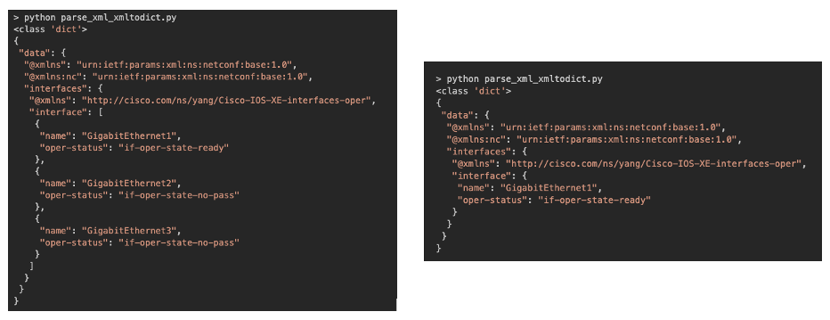

# XML in Python - Don't be lazy
I'm referring to the great post by my buddy with the impressive beard. This is a very short article on why we should use native XML modules to parse XML data in Python - it's kind of a "in a nutshell" post, I'm planning to write a more detailed post on working with XML in Python in the near future. 

# XML!? Just convert it into JSON
If you're lazy (like me), you'll probably think "okay I understand this XML-thing...however, there must be a way to just translate this into a dict/JSON". And for sure there is: xmltodict (https://github.com/martinblech/xmltodict) is a module often used by Network Engineers to parse XML (NETCONF) data.

For example, let's parse some output collected via NETCONF from a Cisco router.
```xml
<data xmlns="urn:ietf:params:xml:ns:netconf:base:1.0" xmlns:nc="urn:ietf:params:xml:ns:netconf:base:1.0">
        <interfaces xmlns="http://cisco.com/ns/yang/Cisco-IOS-XE-interfaces-oper">
                <interface>
                        <name>GigabitEthernet1</name>
                        <oper-status>if-oper-state-ready</oper-status>
                </interface>
                <interface>
                        <name>GigabitEthernet2</name>
                        <oper-status>if-oper-state-no-pass</oper-status>
                </interface>
                <interface>
                        <name>GigabitEthernet3</name>
                        <oper-status>if-oper-state-no-pass</oper-status>
                </interface>
        </interfaces>
</data>
```

All we need is the xmltodict.parse function:
```python
import xmltodict
import json

# Read XML content from file
with open("xml_output.xml", "r") as fo:
    xml = fo.read()

# parse it using xmltodict
parsed_xml = xmltodict.parse(xml)

# print the type of the parsed object
print(type(parsed_xml))

# pretty print the data using json.dumps
print(json.dumps(parsed_xml, indent=1))
```

Running the above script results in this:
```bash
> python parse_xml_xmltodict.py                                                                                                                                                                                                                     
<class 'dict'>
{
 "data": {
  "@xmlns": "urn:ietf:params:xml:ns:netconf:base:1.0",
  "@xmlns:nc": "urn:ietf:params:xml:ns:netconf:base:1.0",
  "interfaces": {
   "@xmlns": "http://cisco.com/ns/yang/Cisco-IOS-XE-interfaces-oper",
   "interface": [
    {
     "name": "GigabitEthernet1",
     "oper-status": "if-oper-state-ready"
    },
    {
     "name": "GigabitEthernet2",
     "oper-status": "if-oper-state-no-pass"
    },
    {
     "name": "GigabitEthernet3",
     "oper-status": "if-oper-state-no-pass"
    }
   ]
  }
 }
}
```

As expected our XML data was successfully converted into a dict and we can now consume the data in a easy way.

# So far, so good - What's the problem?
When converting XML into a dict, the resulting data may be inconsistent depending on the structure of the content being parsed. Do demonstrate this, I slightly change the XML data: Let's assume we query another router and get the follwing result (1 instead of 3 interfaces).

```xml
<data xmlns="urn:ietf:params:xml:ns:netconf:base:1.0" xmlns:nc="urn:ietf:params:xml:ns:netconf:base:1.0">
        <interfaces xmlns="http://cisco.com/ns/yang/Cisco-IOS-XE-interfaces-oper">
                <interface>
                        <name>GigabitEthernet1</name>
                        <oper-status>if-oper-state-ready</oper-status>
                </interface>
        </interfaces>
</data>
```

If we run the same Python script again (loading the modified XML data), we'll end up with this result:
```bash
> python parse_xml_xmltodict.py                                                                                                                                                                                                                     
<class 'dict'>
{
 "data": {
  "@xmlns": "urn:ietf:params:xml:ns:netconf:base:1.0",
  "@xmlns:nc": "urn:ietf:params:xml:ns:netconf:base:1.0",
  "interfaces": {
   "@xmlns": "http://cisco.com/ns/yang/Cisco-IOS-XE-interfaces-oper",
   "interface": {
    "name": "GigabitEthernet1",
    "oper-status": "if-oper-state-ready"
   }
  }
 }
}
```

Do you spot the difference? Have a look at the data type of the interface value (parsed_xml["data"]["interfaces"]["interface"]): If there are multiple interfaces, like in our first example, xmltodict puts all interfaces in a list, if there is just one, the resulting value is a dict.



Such behaviour may break our scripts - For example this would work in the first case, but would fail with an AttributeError in the second case:

```python
# print interface name and oper state for all interfaces
for intf in parsed_xml.get("data").get("interfaces").get("interface"):
    print(intf.get("name"), intf.get("oper-status"))
```

# Solution - use native XML modules
Long story short: Whenever dealing with XML, use native modules to parse the content. There are multiple modules, one of the most often used is the XML ElementTree API (https://docs.python.org/3/library/xml.etree.elementtree.html).

Let's have a look at the basics of the API.

First we load the XML data in a ElementTree object:
```python
import xml.etree.ElementTree as ET

tree = ET.parse("xml_output.xml")
root = tree.getroot()
```

We can now interate over the tree, for example let's print all tag names:
```python
for itr in root.iter():
    print(itr.tag)
```

```bash
> python parse_xml.py 
{urn:ietf:params:xml:ns:netconf:base:1.0}data
{http://cisco.com/ns/yang/Cisco-IOS-XE-interfaces-oper}interfaces
{http://cisco.com/ns/yang/Cisco-IOS-XE-interfaces-oper}interface
{http://cisco.com/ns/yang/Cisco-IOS-XE-interfaces-oper}name
{http://cisco.com/ns/yang/Cisco-IOS-XE-interfaces-oper}oper-status
{http://cisco.com/ns/yang/Cisco-IOS-XE-interfaces-oper}interface
{http://cisco.com/ns/yang/Cisco-IOS-XE-interfaces-oper}name
{http://cisco.com/ns/yang/Cisco-IOS-XE-interfaces-oper}oper-status
{http://cisco.com/ns/yang/Cisco-IOS-XE-interfaces-oper}interface
{http://cisco.com/ns/yang/Cisco-IOS-XE-interfaces-oper}name
{http://cisco.com/ns/yang/Cisco-IOS-XE-interfaces-oper}oper-status 
```

Notice, the tags use a special format: _{namespace}tag_. 

To find interesting elements, we can search fol all interface-tags using the _findall-method_. _findall_ returns only elements with a tag which are a direct children of the current element. If the interesting elements are located further down the tree, we use a xPath expression to search for the elements. In our case the _interface_ tags are located under _data/interfaces/interface_ which translates to _.//interface_ using xPath. To find the elements we also need to put the namespace into our xPath expression: _.//{http://cisco.com/ns/yang/Cisco-IOS-XE-interfaces-oper}interface_

```python
for intf in root.findall(".//{http://cisco.com/ns/yang/Cisco-IOS-XE-interfaces-oper}interface"):
    print(intf.tag)
```

```bash
> python parse_xml.py 
{http://cisco.com/ns/yang/Cisco-IOS-XE-interfaces-oper}interface
{http://cisco.com/ns/yang/Cisco-IOS-XE-interfaces-oper}interface
{http://cisco.com/ns/yang/Cisco-IOS-XE-interfaces-oper}interface
```

To print the name and oper-status of the interfaces we use the _find-method_ and print the content using _.text_:
```python
for intf in root.findall(".//{http://cisco.com/ns/yang/Cisco-IOS-XE-interfaces-oper}interface"):
    print(intf.find("{http://cisco.com/ns/yang/Cisco-IOS-XE-interfaces-oper}name").text)
    print(intf.find("{http://cisco.com/ns/yang/Cisco-IOS-XE-interfaces-oper}oper-status").text)
    print()
```

```bash
> python parse_xml.py 
GigabitEthernet1
if-oper-state-ready

GigabitEthernet2
if-oper-state-no-pass

GigabitEthernet3
if-oper-state-no-pass
```

To cleanup things instead of using the special _{namespace}tag_ format, we usually use a namespace dict:
```python
ns = {"ios_intf_oper":"http://cisco.com/ns/yang/Cisco-IOS-XE-interfaces-oper"}

for intf in root.findall(".//ios_intf_oper:interface", ns):
    print(intf.find("ios_intf_oper:name", ns).text)
    print(intf.find("ios_intf_oper:oper-status", ns).text)
    print()
```

This was a very quick intro in the XML ElementTree API, for more information check out the tutorial/doc at [ET Doc/Tutorial](https://docs.python.org/3/library/xml.etree.elementtree.html)